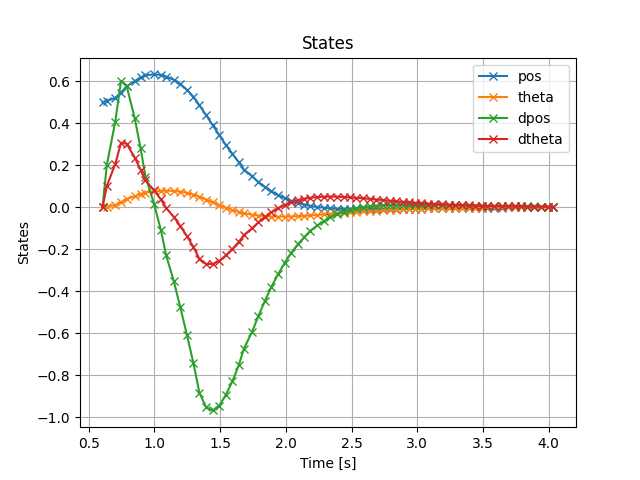
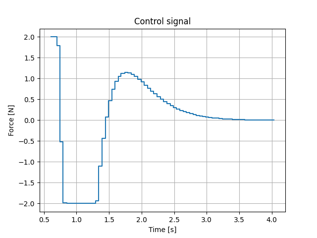

**********************
C/C++ Impact library
**********************

Numerical backend library containing a concrete low-level problem formulation coupled to a solver that is either included as fully self-contained C code, linked in with a dependency on the C++ CasADi runtime library and chosen solver plugin such as IPOPT, or linked in as third-party dependencies such as OSQP.
A set of C functions are generated to be used in C/C++ applications. The C API functions are generated in the folder `export_name + _build_dir`. The C API includes the following files:

* :code:`export_name + _codegen.c` is the source file generated by CasADi with all code-generated functions of the problem.
* :code:`export_name.c` is the source file that contains the Impact function definitions that creates all the user functionalities like set parameter values, solve the problem, get variable values and so on.
* :code:`export_name + _s_function_level2.c` crates an S-function level 2 for the Simulink block. The S-function is a special type of Simulink block that allows you to create custom blocks using C/C++ code. 
* :code:`hello_world + export_name.c` is a simple example of how to use the C API functions. It includes the main function that calls the Impact functions to create the problem, set the parameter values, solve the problem, and get the variable values.
* :code:`hello_world + export_name.py` example in python of how to use the C API functions. It sets parameters and solve the OCP problem once, and then it solves the OCP multiple times in a loop.
* :code:`build.m` It is a script to build the S-function level 2. It uses the `mex` command to compile the C code and create the S-function. The script also includes the necessary flags and options for the compilation. If the problem was exported in Matlab, this compilation will be executed automatically, if the problem was exported in Python, this script should be executed to compile the S-functions. 

There are more complementary files like headers, libraries, and folders that can change base on the options selected for the problem and its dependencies.

**********************
Simulink block
**********************
Additional artifact that will appear in the folder `export_name + _build_dir` is the Simulink block. The Simulink block is a representation of the OCP problem that can be dragged and dropped in any Simulink scheme. 
The Simulink block interfaced the S-function level 2. All the necessary parameters for the OCP problem appear as input ports of corresponding dimensions. Solution as control inputs and states appear as output ports. An additional port provides solver stats, it can be extract it using a *Bus Selector* block. 

Additionally to the MPC block, an integrate block is generated. This block is an integrator that can be used to simulate the states of the system. This model correspond to the one is considered inside the optimization problem. 
Also a cost block is created that with all variables and parameters of the problem calculates the cost function. This block can be used to track the cost function in the Simulink scheme. 

The set *IMPACT MPC* and *integrate_* blocks can be used to simulate the system in closed loop. The *IMPCT MPC* block will provide the control inputs to the *integrate_* block, and the *integrate_* block will provide the states to the *IMPACT MPC* block.
The diagram looks like the example at :ref:`Simulation_using_exported_artifacts`

.. image:: ../tutorial/imagesGetting/SimulinkScheme.png
    :width: 350 px
    :align: center
    :alt: Simulink scheme

The model block requires the sample time :code:`Ts` and a memory block to buffer the states value one sample time. Inside the memory block the initial value :code:`x0` is defined.
All parameters definded in the problem will appear as input ports of the *IMPACT MPC* block. The control inputs and states will appear as output ports. The solver stats will appear as an additional output port.

After simulating, tunning parameters and if the performance and solving time are adequate, these blocks can be used to deploy the OCP problem in a real-time target.
Because the Simulink blocks are interfacing a compiled S-function, it can be deploy straight to a real-time target like Speedgoat using the friendly-user Simulink tools.

* Deploying the scheme from :ref:`Simulation_using_exported_artifacts` on real-time hardare is called Hardaware-in-the-loop (HIL) simulation. `Basics of Hardware-in-the-Loop Simulation <https://nl.mathworks.com/help/simscape/ug/what-is-hardware-in-the-loop-simulation.html>`_ This is mainly used to test and verify the controller time response, but also, the controller performance and model accuracy.
* Interfacing peripheral devices like sensors and actuators the full system can be tested. 

For more information about the deployment of the Simulink blocks, please refer to Matlab documentation like `Build a real-time application <https://nl.mathworks.com/videos/build-and-run-a-real-time-application-1577441069476.html>`_  

****************************
ROS 2 Node: Build & Test Guide
****************************

Overview
========

IMPACT can export an additional artifact: a **ROS 2 package**.  
This is enabled with the option ``ros2=True`` during export (default is ``False``).  

The package contains C++ nodes that wrap the OCP problem:

* ``<export_name>_controller``  MPC controller node.

  The controller node subscribes to:

  * ``x_current``  mandatory parameter to feed state values.
  * ``parameters``  problem parameters (vector sized to problem definition).
  * ``x_initial_guess``  initial guess of states (vector, horizon length).
  * ``u_initial_guess``  initial guess of control inputs (vector, horizon length).
  * ``hotstart``  solver warm-start flag:
  
    * ``1`` → use previous solution (*hotstart*).
    * ``0`` → use zeros or user guesses (*coldstart*).
    * ``-1`` → reuse primal but reset duals (*freshstart*).

  The controller node publishes:

  * ``x_opt`` – optimal state trajectory.
  * ``control_to_apply`` – optimal control sequence (horizon dependent).

* ``<export_name>_model`` – system model node.

  The model node subscribes to:

  * ``x_current`` – current state to propagate.
  * ``control_to_apply`` – control input applied to the model.
  * ``parameters`` – model parameters (if defined).

  The model node publishes:

  * ``x_next`` – propagated next state given ``x_current`` and ``control_to_apply``.
  
Both nodes expose ROS 2 topics for integration in any ROS 2 setup.

Assumptions
================
From this point onward, the commands and structure correspond to ROS 2 *Jazzy* in Ubuntu 24.04. But it can be adapted to other ROS 2 distros and OSes. Commands are definded respect to the cart pendulum example of this documentation, and can be adapted to other exported packages.

*  ROS 2 Jazzy is installed via APT and available at ``/opt/ros/jazzy``.
*  The workspace root is <workspace>.
*  A Conda environment provides CasADi.
*  The exported package directory ``ROS2_package/cart_pendros/`` (containing ``package.xml``) is already present.
  

Workspace Layout
================

Create a workspace and place the exported package in ``src``:

.. code-block:: bash

   mkdir -p <workspace>/impact_ws/src
   # Then place the exported folder (e.g. ROS2_package/cart_pendros) into <workspace>/impact_ws/src

Environment Setup
=================

Create and activate a Conda environment:

.. code-block:: bash

  conda create -n ros_jazzy -c conda-forge -c robostack -c robostack-jazzy \
    python=3.12 ros-jazzy-ros-base colcon-common-extensions cmake pkg-config casadi -y
  conda activate ros_jazzy

Building the Package
====================

1. Place the exported package (e.g. ROS2_package/cart_pendros) into ``<workspace>/impact_ws/src``.
2. Verify that the file ``ROS2_package/cart_pendros/CMakeLists.txt`` points to CasADi in the Conda env:

   .. code-block:: cmake

      set(CASADI_DIR "<conda-envs-path>/ros_jazzy/lib")
      set(CASADI_INCLUDEDIR "<conda-envs-path>/ros_jazzy/include")

3. Build only the exported package:

   .. code-block:: bash

      source /opt/ros/jazzy/setup.bash
      cd <workspace>/impact_ws
      colcon build --packages-select cart_pendros --symlink-install --cmake-args -DCMAKE_BUILD_TYPE=RelWithDebInfo

Expected result: ``Summary: 1 package finished``.

Running the Nodes
=================

Use separate terminals for each node. 
Controller node:

  .. code-block:: bash

    # Terminal A
    conda activate ros_jazzy
    source /opt/ros/jazzy/setup.bash
    source <workspace>/impact_ws/install/setup.bash

    ros2 run cart_pendros cart_pendros_controller --ros-args --log-level info

Model node:

  .. code-block:: bash

    # Terminal B
    conda activate ros_jazzy
    source /opt/ros/jazzy/setup.bash
    source <workspace>/impact_ws/install/setup.bash
    ros2 run cart_pendros cart_pendros_model --ros-args --log-level info

Testing via Topics
==================
While the nodes are running, in another terminal (can be with or without Conda; sourcing ROS +
overlay is required). To inspect nodes and topics:

  .. code-block:: bash

    source /opt/ros/jazzy/setup.bash
    source <workspace>/impact_ws/install/setup.bash
    ros2 node list
    ros2 topic list -t | grep -i impact

These are examples about how to Publish inputs:

  .. code-block:: bash

    ros2 topic pub -1 /impact/x_current std_msgs/msg/Float32MultiArray "{data: [0.5, 0.0, 0.0, 0.0]}"
    ros2 topic pub -1 /impact/x_end std_msgs/msg/Float32MultiArray "{data: [0.0, 0.0, 0.0, 0.0]}"
    ros2 topic pub -1 /impact/hotstart std_msgs/msg/Float32 "{data: 1.0}"
    # (optional) initial guesses
    # u: length 40
    ros2 topic pub -1 /impact/u_initial_guess std_msgs/msg/Float32MultiArray "{data: [0, 0, 0, 0, 0, 0, 0, 0, 0, 0,  0, 0, 0, 0, 0, 0, 0, 0, 0, 0,  0, 0, 0, 0, 0, 0, 0, 0, 0, 0,  0, 0, 0, 0, 0, 0, 0, 0, 0, 0]}"

Using three additional terminals we can listen topics of interest like ``control_to_apply`` and ``x_next`` and write topic values. For all terminals we should first source ROS + overlay.

  .. code-block:: bash

    source /opt/ros/jazzy/setup.bash
    source <workspace>/impact_ws/install/setup.bash

Read the topic ``control_to_apply``

  .. code-block:: bash

      # Terminal C
    ros2 topic echo --once /impact/control_to_apply

Now, in a different terminal we set the initial state vector to the ``x_current`` topic

  .. code-block:: bash

      # Terminal D
    ros2 topic pub --once /impact/x_current std_msgs/msg/Float32MultiArray "{data: [0.5, 0.0, 0.0, 0.0]}"

In the Terminal C where we execute the command to listen the ``control_to_apply`` we will see the result

  .. code-block:: bash

    layout:
      dim: []
      data_offset: 0
    data:
    - 2.0
    ---
Which means that 2.0 is the first input to apply to the system. Now, back to the Terminal C we read for once the topic ``x_next``

  .. code-block:: bash

      # Terminal C
    ros2 topic echo --once /impact/x_next

Then we can apply that control input value to the model through the command

  .. code-block:: bash

      # Terminal D
    ros2 topic pub --once /impact/control_to_apply std_msgs/msg/Float32MultiArray "{data: [2.0]}"

In the Terminal C where we execute the command to listen the ``x_next`` we will see the result

  .. code-block:: bash

    layout:
      dim: []
      data_offset: 0
    data:
    - 0.505010187625885
    - 0.002507664728909731
    - 0.20081737637519836
    - 0.10061335563659668
    ---

Which are the states of the system in the next sampling time after applying the control input. If now we use these values  to set the ``x_current`` values, and repeat the process, we can get the MPC solution for the system states and control input along time.

Closed-Loop Test with Python
============================

The process of writing/reading topics can be automated.  
The script ``mpc_closed_loop_sync.py`` executes a closed-loop simulation and logs results:

.. code-block:: bash

   cd <Folder that contains mpc_closed_loop_sync.py>
   python3 mpc_closed_loop_sync.py --x0 0.5 0.0 0.0 0.0 --steps 70 --csv mpc_log.csv

With the command the initial state values are defined, the number of steps than in this case is 70,  with sampling time Ts=2/40=0.05 represents 70*0.05=3.5 s of simulation. Results are saved in the file ``mpc_log.csv``
Then, with the file ``plot_mpc_log.py``  the csv is read it and then the results are plotted:

Troubleshooting
===============

* **libcasadi.so not found** → activate the Conda env before running.
* **Build fails on unrelated packages** → build only the exported package:

  .. code-block:: bash

     colcon build --packages-select cart_pendros --symlink-install

* **No output on topics** → ensure one terminal runs the node and another publishes/echoes; both must source ROS + overlay.
* **Check sampling times**:

  .. code-block:: bash

     ros2 param get /controller_cart_pendros_node Ts
     ros2 param get /model_cart_pendros_node Ts

