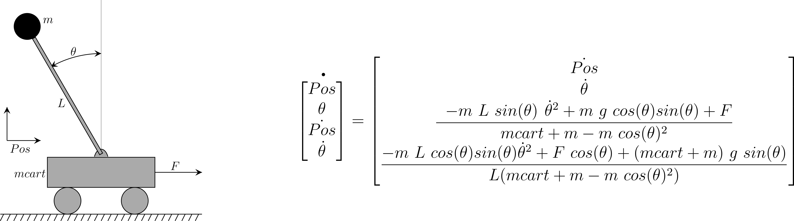
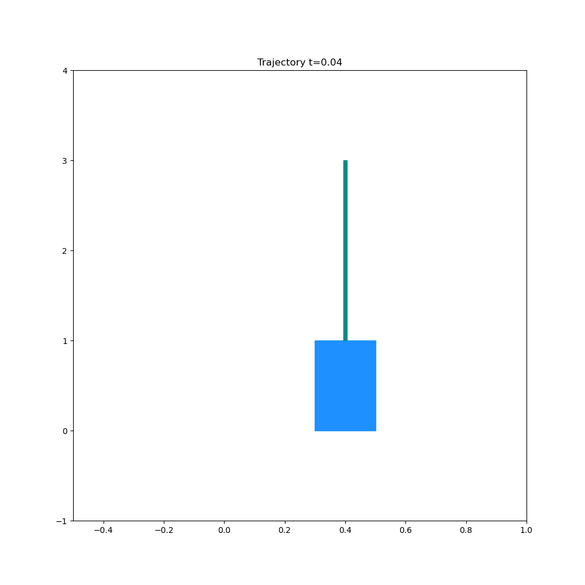
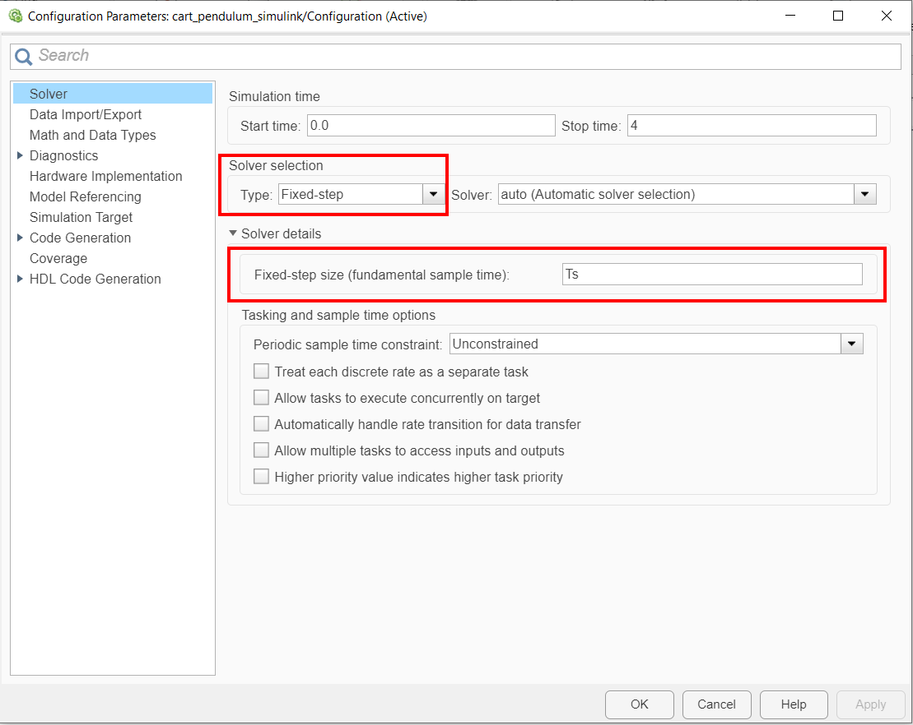
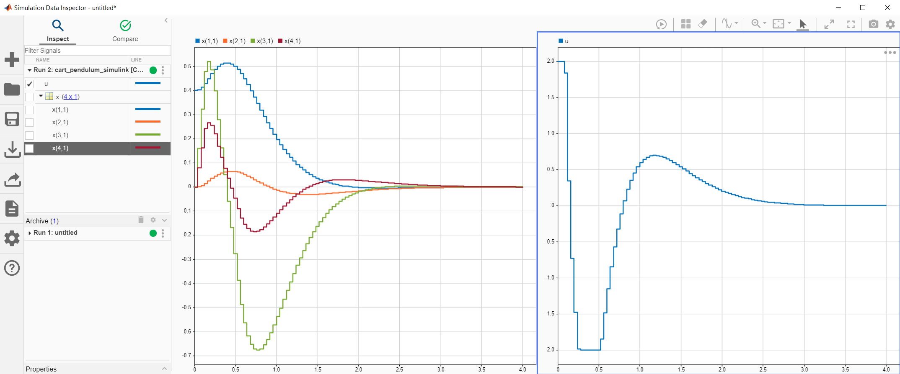

.. role:: raw-math(raw)
    :format: latex html

.. role:: matlab(code)
   :language: matlab
   
**********************
Preliminaries
**********************

To utilize the Impact toolchain, we begin by creating an object and defining all MPC problem characteristics through functions and methods. Once completed, the problem can then be solved or exported, generating various artifacts ready for deployment.

The general structure of the optimal control problem (OCP) we want to solve is

:math:`\begin{equation}
\begin{aligned}
&\underset{\boldsymbol{x},\ \boldsymbol{u}}{\text{min}}&&{\int_{t_0}^{t_f} V(\boldsymbol{x}(t),\boldsymbol{u}(t), \boldsymbol{p})\ \mathrm{d}t}\\
&\text{subject to} && \dot{\boldsymbol{x}}(t) = f(\boldsymbol{x}(t),\boldsymbol{u}(t), \boldsymbol{p}),\\
&&& g(\boldsymbol{x}(t),\boldsymbol{u}(t), \boldsymbol{p}) \leq 0.
\end{aligned}
\end{equation}`

.. _Instantating the MPC object:
************************
Instantiating MPC object
************************
First of all, you need to import Impact

.. tab:: Python

    .. code:: python

        from impact import *
        import casadi as cs

.. tab:: MATLAB

    .. code:: matlab

        addpath(char(py.impact.matlab_path))
        import impact.*

Then, we can instantiate the MPC object. The value of :code:`T` in seconds corresponds to the horizon that the optimal control problem (OCP) will use

.. tab:: Python

    .. code:: python

        mpc = MPC(T = 2.0)

.. tab:: MATLAB

    .. code:: matlab

        mpc = MPC('T', 2.0);

It is possible to have a dynamic horizon length, it will become an additional variable of the problem. Such problems are known as free-time problems.

.. tab:: Python

    .. code:: python

        mpc = MPC(T = FreeTime(2.0))

.. tab:: MATLAB

    .. code:: matlab

        mpc = MPC('T',FreeTime(2.0) );

The value in brackets will be an initial guess, but the horizon length in the solution will depend on the problem itself 

.. _Defining a system model:
***********************
Defining a system model
***********************

MPC (Model Predictive Control) operates on a model-based strategy, making the system model critical for accurate problem definition. 
Typically, the model is represented by Ordinary Differential Equations (ODEs) and Differential-Algebraic Equations (DAEs) in continuous time cases

To illustrate the process of defining a system model, let's examine a cart pendulum example.

:math:`\boldsymbol{x}=[Pos,\theta,\dot{Pos},\dot{\theta}]^T`

Using the methods :code:`.state` and :code:`.control` we define the state variables and inputs.
The method :code:`.set_der` allows us to define derivatives for each state variable.

.. tab:: Python

    .. code:: python

        pos = mpc.state()
        theta = mpc.state()
        dpos = mpc.state()
        dtheta = mpc.state()

        x = cs.vertcat(pos,theta,dpos,dtheta)
        F = mpc.control()

        mpc.set_der(pos, dpos)
        mpc.set_der(theta, dtheta)
        mpc.set_der(dpos,(-m*L*sin(theta)*dtheta**2 + m*g*cos(theta)*sin(theta)+F)/(mcart + m - m*cos(theta)**2) )
        mpc.set_der(dtheta, (-m*L*cos(theta)*sin(theta)*dtheta**2 + F*cos(theta)+(mcart+m)*g*sin(theta))/(L*(mcart + m - m*cos(theta)**2)))

.. tab:: MATLAB

    .. code:: matlab

        pos = mpc.state()
        theta = mpc.state()
        dpos = mpc.state()
        dtheta = mpc.state()

        x = [pos;theta;dpos;dtheta];
        F = mpc.control();

        mpc.set_der(pos, dpos)
        mpc.set_der(theta, dtheta)
        mpc.set_der(dpos,(-m*L*sin(theta)*dtheta^2 + m*g*cos(theta)*sin(theta)+F)/(mcart + m - m*cos(theta)^2) )
        mpc.set_der(dtheta, (-m*L*cos(theta)*sin(theta)*dtheta^2 + F*cos(theta)+(mcart+m)*g*sin(theta))/(L*(mcart + m - m*cos(theta)^2)))

.. _Specifying the problem:
**********************
Specifying the problem
**********************

The problem can be specified in parts, primarily consisting of the cost function and constraints. 
These components can be defined at the beginning, end, or throughout the horizon. 
Additionally, parameters can be employed to further refine the problem definition.

----------------------
Define parameters
----------------------

Parameters are external values defined outside the Optimal Control Problem (OCP) and can be integrated into various parts of the problem, including the dynamics, cost, or constraints.
To create parameters, use the :code:`.parameter` method, specifying a name and length. By default, if only the name is defined, the parameter is treated as a scalar value with a length of one. Alternatively, specifying a length creates a parameter as a vector.
To assign values to parameters, use the :code:`.set_value` method. This allow changes of parameter values at each sample time during execution

.. tab:: Python

    .. code:: python

        x_current = mpc.parameter('x_current',4)
        x_final = mpc.parameter('x_final',4)
        weights = mpc.parameter('weights',2)

        mpc.set_value(x_current, [0.5,0,0,0])
        mpc.set_value(x_final, [0,0,0,0])
        mpc.set_value(weights, [1,1])

.. tab:: MATLAB

    .. code:: matlab

        x_current = mpc.parameter('x_current',4);
        x_final = mpc.parameter('x_final',4);
        weights = mpc.parameter('weights',2);

        mpc.set_value(x_current, [0.5,0,0,0])
        mpc.set_value(x_final, [0,0,0,0])
        mpc.set_value(weights, [1,1])

**Note:** The MPC updates the initial state for solving the problem reading the values from **x_current** parameter. Therefore This parameter should always exist and contain the states values at the beginning of the horizon (at :math:`t_0`). 

-----------------
Add objective
-----------------
The objective can be define in a single or multiple lines using the method :code:`.add_objective`.
Additionally, the methods :code:`.at_t0`, :code:`.integral` and :code:`.at_tf` allow us to specify if the cost function consider the expression at initial time (:math:`t_0`), along the horizon or at the end of the horizon (:math:`t_f`) 

Let's consider the following cost function
:raw-math:`$$ \int_{t_0}^{t_f}\left(w_0*F^2 + 100*w_1*Pos^2 \right) \mathrm{d}t $$`

.. tab:: Python

    .. code:: python

        mpc.add_objective(mpc.integral(weights[0]*cart_pendulum.F**2 + weights[1]*100*cart_pendulum.pos**2))

.. tab:: MATLAB

    .. code:: matlab
        
        mpc.add_objective(mpc.integral(weights(1)*cart_pend.F^2 + weights(2)*100*cart_pend.pos^2));

Or equivalently

.. tab:: Python

    .. code:: python

        mpc.add_objective(mpc.integral(weights[0]*cart_pendulum.F**2 ))
        mpc.add_objective(mpc.integral(weights[1]*100*cart_pendulum.pos**2 )) 

.. tab:: MATLAB

    .. code:: matlab
        
        mpc.add_objective(mpc.integral(weights(1)*cart_pend.F^2));
        mpc.add_objective(mpc.integral(weights(2)*100*cart_pend.pos^2)); 

The cost function can be defined as any expression involving states, inputs, and parameters. It is important for users to consider properties such as convexity and their implications on the solving process during the design phase.

.. _Set_constraints:
-----------------
Set constraints
-----------------
Constraints can be defined using the method :code:`.subject_to`.
Additionally, the methods :code:`.at_t0`, :code:`.integral` and :code:`.at_tf` allow us to specify constraints at initial time (:math:`t_0`), along the horizon or at the end of the horizon (:math:`t_f`).
Option ``'include_first'`` is true by default. For states in an MPC fashion scheme is desirable to have it false to avoid a collision with the initial state constraint. 

Let's consider the following constraints

:math:`\begin{equation}
\begin{aligned}
\boldsymbol{x}(t_0) & =   \boldsymbol{x}_{current}\\
\boldsymbol{x}(t_f) & =   \boldsymbol{x}_{final}\\
\dot{\boldsymbol{x}}(t) & =  f(\boldsymbol{x}(t),\boldsymbol{u}(t), \boldsymbol{p}), \ \text{for} \  t \in [t_0,t_f]\\
-2 & <=  F <= 2  \ \text{for} \  t \in [t_0,t_f]\\
-2 & <=  Pos <= 2  \ \text{for} \  t \in (t_0,t_f]\\
\end{aligned}
\end{equation}`

.. tab:: Python

    .. code:: python

        ## Boundary constraints
        mpc.subject_to(mpc.at_t0(cart_pendulum.x)==x_current)
        mpc.subject_to(mpc.at_tf(cart_pendulum.x)==x_final)

        ## Path constraints
        mpc.subject_to(-2 <= (cart_pendulum.F <= 2 ))
        ## In MPC, you typically do not want to enforce state constraints at the initial time
        mpc.subject_to(-2 <= (cart_pendulum.pos <= 2), include_first=False)

.. tab:: MATLAB

    .. code:: matlab

        % Initial constraints
        mpc.subject_to(mpc.at_t0(cart_pend.x)==x_current)
        mpc.subject_to(mpc.at_tf(cart_pend.x)==x_final)

        % Path constraints
        mpc.subject_to(-2 <= cart_pend.F <= 2 )
        % In MPC, you typically do not want to enforce state constraints at the initial time
        mpc.subject_to(-2 <= cart_pend.pos <= 2, 'include_first', false)

**Note:** The system dynamics are not defined explicitly in the constraints, this is because Impact toolchain includes it automatically. 

-----------------------
Set solver back-end
-----------------------
The Solver has a paramount importance for solving the optimal control problem each sample time. As the Impact toolchain is built on top of `Rockit <https://github.com/meco-group/rockit?tab=readme-ov-file>`_ and `CasADi <https://web.casadi.org/>`_, all solvers avaiable in those tools can be used within Impact.
Let's assume we want to use *ipopt* solver .

.. tab:: Python

    .. code:: python

        options = {"ipopt": {"print_level": 0}}
        options["expand"] = True
        options["print_time"] = False
        mpc.solver('ipopt',options)

.. tab:: MATLAB

    .. code:: matlab

        % Solver
        options = struct;
        options.ipopt.print_level = 0;
        options.expand = true;
        options.print_time = false;

        mpc.solver('ipopt',options);

----------------------------
Set transcription method
----------------------------
In this point the user defines the transcription method. This is the procedure to transform the optimal control problem (OCP) to a nonlinear programing (NLP) problem. This is the type of problems that solvers address.
Thu user can choose among ``SingleShooting``, ``MultipleShooting`` or ``DirectCollocation``. Let's consider MultipleShooting for 40 samples in the horizon.

.. tab:: Python

    .. code:: python

        method = MultipleShooting(N=40,M=2)
        mpc.method(method)

.. tab:: MATLAB

    .. code:: matlab

        method = MultipleShooting('N',40,'M',2);
        mpc.method(method);

With the problem fully defined, users have two options: export the problem to obtain various artifacts for deployment or solve it and simulate the process. 
Let's proceed to solve the problem:

.. tab:: Python

    .. code:: python

        sol=mpc.solve()

.. tab:: MATLAB

    .. code:: matlab

        sol=mpc.solve();

In case the solver fails, you can still look at the solution: 
``sol = mpc.non_converged_solution``

.. _Post-processing_the_MPC_solution:

********************************
Post-processing the MPC solution
********************************
Once the problem is solved, Impact toolchain has different options to extract the solution
The user can retreive any variable of the problem for certain grid. 
The grid can be :code:`control` which is the one refereing to the sample time, the points where the piecewise constan input is changed.
The grid can also be :code:`integrator` that for the case of multiple shooting for :math:`M>=2` will be more fine than control. Additionally, the integrator can be refined by an integer value to evaluate the system behavior between sampling times.
The OCP solution of the cart pendulum for different grids can be plotted as

.. tab:: Python

    .. code:: python

        # Sample a state/control or expression thereof on a grid
        tsa, x1a = sol.sample(cart_pendulum.pos, grid='control')
        tsol, Fsol = sol.sample(cart_pendulum.F, grid='control')

        from pylab import *
        figure()
        plot(tsa, x1a, marker="o",markersize=8)
        xlabel('Times [s]')
        ylabel('Position [m]')
        legend(['Control grid'])
        title('Position x(1)')
        grid(True)

        figure()
        step(tsol,Fsol)
        title("Control signal")
        xlabel("Times [s]")
        grid(True)

        show(block=True)
    .. image:: imagesGetting/posFPy.png

.. tab:: MATLAB

    .. code:: matlab

        % Sample a state/control or expression thereof on a grid
        [tsa, x1a] = sol.sample(cart_pend.pos, 'grid', 'control');
        [tsol, Fsol] = sol.sample(cart_pend.F, 'grid', 'control');

        figure()
        hold on
        plot(tsa, x1a, '-o','markersize',8,'Color',[0 0.4470 0.7410])
        xlabel('Times [s]')
        ylabel('Position [m]')
        legend('Control grid')
        grid on
        title('Position x(1)')

        figure()
        stairs(tsol,Fsol,'linewidth',2)
        title('Control signal')
        xlabel('Times [s]')
        grid on

    .. image:: imagesGetting/posFMat.png

Please note that the sampling time is determined by the horizon and the number of samples within it, calculated as follows: :raw-math:`$$ T_s=\frac{horizon}{samples}=\frac{2}{50}=0.04 [s]$$`

For :code:`control` option: Sampling time of :math:`0.04 [s]`
    

***************************************************
Simulation by Code
***************************************************

In order to simulate the MPC controller, we require a system model in addition to solving the optimization problem. Since we are not considering any model mismatch in this context, we can utilize the :code:`.discrete_system()` method to extract the discretized version of the provided system model.
Additionally, we need to define variables to log the results at each sample time. Then, we can set up a loop to iterate over the simulation time. Each sample time, the current states value should be updated using the :code:`.set_value()` metod. 
A code example for the MPC loop and for plotting the results is

.. tab:: Python

    .. code:: python

        Ts=2/N # sampling time (horizon/# samples)
        Tsim=3.5 # simulating time
        samples=int(floor(Tsim/Ts))  #numbers of samples to simulate
        xlog=np.zeros([cart_pendulum.nx,samples])   # variable to log states
        ulog=np.zeros([cart_pendulum.nu,samples])   # variable to log the input
        xlog[:,0]=x0

        t=np.zeros([samples])
        Sim_pendulum_dyn = mpc._method.discrete_system(mpc) # get the discrete model as CasADi function

        for i in range(samples):
            mpc.set_value(x_current, xlog[:,i]) # Set the currrent state values to x_current

            sol = mpc.solve() # Solve the optimization problem
            tsol, xsol = sol.sample(cart_pendulum.x, grid='control')
            tsol, usol = sol.sample(cart_pendulum.u, grid='control')
            
            current_X = Sim_pendulum_dyn(x0=xlog[:,i], u=usol[0], T=Ts)["xf"] # Simulate dynamics (applying the first control input) and update the current state

            xlog[:,i+1:i+2] = current_X[:,0].full()  # Log data 
            ulog[:,i]   = usol[0]  # Log data 
            t[i]=i*Ts  # Time vector

        figure()
        plot(t, xlog[0,:], marker="*",markersize=5)
        plot(t, xlog[1,:], marker="*",markersize=5)
        plot(t, xlog[2,:], marker="*",markersize=5)
        plot(t, xlog[3,:], marker="*",markersize=5)
        xlabel('Times [s]')
        ylabel('States')
        legend(['pos','theta','dpos','dtheta'])
        title('States')
        grid(True)

        figure()
        step(t,ulog[0,:])
        title("Control signal")
        ylabel("Force [N]")
        xlabel("Times [s]")
        grid(True)

        show(block=True)

.. tab:: MATLAB

    .. code:: matlab

        Ts=2/N; % sampling time (horizon/# samples)
        Tsim=3.5; % simulating time
        samples=floor(Tsim/Ts); % numbers of samples to simulate
        xlog=zeros(cart_pend.nx,samples); % variable to log states
        ulog=zeros(cart_pend.nu,samples); % variable to log the input
        xlog(:,1)=x0; 

        t=zeros(1,samples);
        discrete_dynamics = mpc.discrete_system(); % get the discrete model as CasADi function

        for i=1:1:samples
            mpc.set_value(x_current, xlog(:,i)); % Set the currrent state values to x_current

            sol = mpc.solve(); %Solve the optimization problem
            [tsol, xsol] = sol.sample(cart_pend.x, 'grid', 'control');
            [tsol, usol] = sol.sample(cart_pend.u, 'grid', 'control');

            xlog(:,i+1)=full(discrete_dynamics(xlog(:,i),usol(:,1),Ts,0,[xlog(:,i)',zeros(1,4),1,1],0)); % Simulate dynamics (applying the first control input) and update the current state
            ulog(:,i)=usol(:,1); % Log data 
            t(i)=(i-1)*Ts; %Time vector
        end

        figure
        hold on
        plot(t,xlog(1,1:end-1), '-*','markersize',6,'linewidth',2,'Color',[0 0.4470 0.7410])
        plot(t,xlog(2,1:end-1), '-*','markersize',6,'linewidth',2,'Color',[0.8500 0.3250 0.0980])
        plot(t,xlog(3,1:end-1), '-*','markersize',6,'linewidth',2,'Color',[0.4660 0.6740 0.1880])
        plot(t,xlog(4,1:end-1), '-*','markersize',6,'linewidth',2,'Color',[0.6350 0.0780 0.1840])
        legend('pos','theta','dpos','dtheta')
        xlabel('Time [s]')
        ylabel('States')
        grid on

        figure
        hold on
        stairs(t,ulog(1,:),'linewidth',2)
        xlabel('Time [s]')
        ylabel('Force [N]')
        grid on

We anticipate that the state trajectory will diverge from the Optimal Control Problem (OCP) trajectory. This discrepancy arises because the final constraint (at the end of the horizon) is receding and becomes less restrictive with each sample time. Consequently, this results in a solution that is more relaxed compared to the initial OCP solution.
The results for stats and input are:

.. tab:: Python

    .. image:: imagesGetting/MPCPy.png

.. tab:: MATLAB

    .. image:: imagesGetting/MPCMat.png

Note that the system starts in the initial state defined (:math:`[0.4,0,0,0]`) and then it's driven to the reference point (:math:`[0,0,0,0]`). Visualizing these results in the system looks like:

        

.. _Simulation_using_exported_artifacts:

***************************************************
Simulation using exported artifacts (Simulink)
***************************************************

Impact can generate various artifacts, including a Simulink block that encapsulates the entire optimization problem. This block enables users to conveniently implement the MPC scheme in Simulink by simply dragging and dropping it into the simulation.
To obtain this artifact, export the MPC object that you created using the :code:`.export()` method. By default, this will create the Simulink block.

.. tab:: Python

    .. code:: python

        mpc.export('cart_pend')

.. tab:: MATLAB

    .. code:: matlab

        mpc.export('cart_pend');

After executing this command, the problem is compiled. Please note that you will need a C/C++ compiler installed on your system or software environment.
For Python, you will need to manually build the project. However, in MATLAB, the build process is automatic.
As a result, a folder named according to the assigned name plus *'_build_dir'* will be created. This folder contains artifacts in the form of C functions and their compiled versions. 

Additionally, a .sxl Simulink file named *'library_'* plus the name is created. It contains different Simulink blocks, among them, the controller block (*IMPACT MPC*) and the discretized system block (*integrate_*), which are the ones we will use for simulation.

.. image:: imagesGetting/SimulinkScheme.png
    :width: 350 px
    :align: center

This scheme represent the MPC controller in close loop for the case without model mismatch. 

The discrete model block requires the sample time :code:`Ts` and a memory block to buffer the states value one sample time. Inside the memory block the initial value (:code:`x0`) is defined. 

All parameters defined in the problem will appear as input ports of the *IMPACT MPC* block. We need to define the values for the reference (:math:`[0,0,0,0]`) and the values for the weights (:math:`[1,1]`).

Ports for states and input initial guess will appear in case the user can provide an smart initial guess. With the hotstart port as :code:`1`, the block will use the solution from previous sample time as initial guess. 

Configuration of the solver parameters in Simulink is important, to address the discrete nature of the problem. Therefore the solver should be Fixed-step (constant sampling time), and the step size should be the samling time :code:`Ts`. The following image shows the solver Configuration

Now we are ready to excecute the simulation. Finally we select the states and inputs as varibales to log, and we run it. Results from the Data inspector visualizer are shown in the next figure:

This result is exactly the same we got simulating by code.

